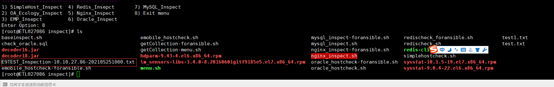
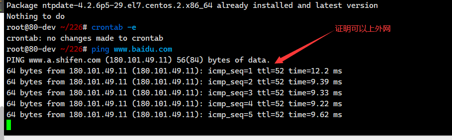

## **巡检总体流程**
1. 提交新客户上线前巡检流程
2. 此页面下载巡检工具收集数据
	数据格式为 类型_Inspection-IP-日期.txt 例如`EMP_Inspection-10.10.27.160-202204271007.txt`
3. 将收集到的数据放置到流程中
4. 联系巡检人生成巡检报告
5. 解压巡检报告压缩包,双击index.html查看巡检报告

**`若有疑问,请先查看左侧页面的常见问题`**

**`巡检无需停止OA服务,且不可停止OA服务,巡检脚本会调用OA接口查询数据`**

## **巡检工具下载地址**

1. [windows](https://yq.weaver.com.cn/file/fileNoLogin/6ba6ed0e8f3f42c1881b24d4d9d8ca9f)
2. [linux](https://yq.weaver.com.cn/file/fileNoLogin/35d429807a7446aeae6ca29e8b7a2ca4)

## **巡检工具使用指南**
### windows版本

`不支持windows 2008,只支持2012以上操作系统`

1. 将巡检工具放置在ecology同级目录下


2. 解压巡检工具，并修改配置文件


3.  配置文件说明如下


4.  配置完成`双击OAInspect.exe`如下：


5. 运行完成后，会在本地weaver路径生成一个`客户名_Windows2021-08-05-13-31_192.168.81.75_WEAVERZHE.json`,请将本文件，附到巡检流程里面


6. SQLserver巡检说明`注意一定要放置到SQLServer主机上,不能放置到OA主机上`


`因服务器负载和配置有差异，bat窗口的运行时间可能会长会短，请耐心等待，最长不超过5分钟，如果无响应请按回车键,oa巡检,请将巡检脚本放置到oa主机上,sqlserver巡检请将巡检脚本放置到sqlserver主机上`
  ### Linux版本

   `注意所有服务器都必须上传巡检脚本,然后根据主机角色选择对应的菜单,比如oracle主机,先上传巡检脚本,然后执行menu.sh,选择oracle巡检`
  #### OA巡检

  1. 上传巡检脚本到服务器,任意位置(建议/tmp),创建巡检目录并解压

  `mkdir -p inspect && tar -zxvf Linux-inspect.tar.gz -C inspect && cd inspect`

  2. 使用shell运行脚本 `sh menu.sh`,选择需要巡检的项目,暂时支持单主机巡检,OA巡检,EMP巡检(`EM7 不支持老EM,比如EM6,Ebridge,emessage等`),Redis巡检,Nginx巡检,Oracle巡检,MySQL巡检,单OA巡检(`适用于非Resin中间件,比如tomcat,东方通等`)


  3. 选择`1`,执行OA巡检,如下:

   


  `输入oa,resin,jdk路径,如果与default一致,回车即可`

  

  4. 将文件附在巡检流程里面,文件名应为`客户名_Inspection-内网IP-时间.txt`,比如`中国交通信息科技集团有限公司_Inspection-10.100.3.2-202110121449.txt`

  

  #### EMP巡检

  `*注意,EMP会自动巡检EMP所用Redis,MySQL,请勿重复执行巡检脚本,巡检redis,mysql*`

  1. 上传巡检脚本到EMP服务器,任意位置(建议/tmp),创建巡检目录并解压

   `mkdir -p inspect && tar -zxvf Linux-inspect.tar.gz -C inspect && cd inspect`

  2. 执行`sh menu.sh`,选择`2`,执行EMP巡检,输入安装路径,默认为`/usr/emp`
  3. 将文件附在巡检流程里面,文件名应为`EMP_Inspection-内网IP-时间.txt`


  #### Redis巡检

  1. 上传巡检脚本到Redis服务器,任意位置(建议/tmp),创建巡检目录并解压

   `mkdir -p inspect && tar -zxvf Linux-inspect.tar.gz -C inspect && cd inspect`

  2. 执行`sh menu.sh`,选择`3`,执行Redis巡检,输入Redis端口,密码(若不知道Redis端口密码,请查看OA下`ecology/WEB-INF/prop/weaver_new_session.properties`,若为redis哨兵,请使用`ps -aux |grep redis`查看,默认为6379或6381)
  3. 将文件附在巡检流程里面,文件名应为`Redis_Inspection-内网IP-时间.txt`


  #### Nginx巡检

   1. 上传巡检脚本到Nginx服务器,任意位置(建议/tmp),创建巡检目录并解压

   `mkdir -p inspect && tar -zxvf Linux-inspect.tar.gz -C inspect && cd inspect`

  2. 执行`sh menu.sh`,选择`4`,执行Nginx巡检,输入`Nginx可执行文件路径`
  3.  将文件附在巡检流程里面,文件名应为`Nginx_Inspection-内网IP-时间.txt`

  


  ####  Oracle巡检

  `请注意,若为Oracle集群,只需要巡检集群中一台即可`

  1. 上传巡检脚本到Oracle服务器,任意位置(建议/tmp),创建巡检目录并解压

   `mkdir -p inspect && tar -zxvf Linux-inspect.tar.gz -C inspect && cd inspect`

  2. 执行`sh menu.sh`,选择`5`,执行Oracle巡检,输入`OA使用的用户名`
  3. 将文件附在巡检流程里面,文件名应为`Oracle_Inspection-内网IP-时间.txt`

  


  ####  MySQL巡检

  1. 上传巡检脚本到MySQL服务器,任意位置(建议/tmp),创建巡检目录并解压

   `mkdir -p inspect && tar -zxvf Linux-inspect.tar.gz -C inspect && cd inspect`

  2. 执行`sh menu.sh`,选择`6`,执行MySQL巡检,输入`参数(账号,密码,主机,端口)`,请输入OA中`weaver.properties`配置的账号密码
  3.  将文件附在巡检流程里面,文件名应为`MYSQL_Inspection-内网IP-时间.txt`

  


  #### Tomcat-Ecology巡检(适用于Tomcat中间件)

  1. 上传巡检脚本到OA服务器,任意位置(建议/tmp),创建巡检目录并解压

   `mkdir -p inspect && tar -zxvf Linux-inspect.tar.gz -C inspect && cd inspect`

  2. 执行`sh menu.sh`,选择`7`,执行OA巡检,输入`参数(ecology路径,tomcat路径,jdk路径)`
  3. 将文件附在巡检流程里面,文件名应为`公司名_Inspection-内网IP-时间-Tomcat.txt`

 


#### OtherOS-Ecology巡检(适用于非Redhat/Centos系列主机,容器化环境)

  1. 上传巡检脚本到OA服务器,任意位置(建议/tmp),创建巡检目录并解压

   `mkdir -p inspect && tar -zxvf Linux-inspect.tar.gz -C inspect && cd inspect`

  2. 执行`sh menu.sh`,选择`8`,执行OA巡检,输入`参数(ecology路径,Resin路径,jdk路径)`
  3. 将文件附在巡检流程里面,文件名应为`公司名_Inspection-内网IP-时间-Resin-OnlyOA.txt`

    

#### NFS巡检

	*若无NFS主机,则不用巡检*
  1. 上传巡检脚本到NFS服务器,任意位置(建议/tmp),创建巡检目录并解压

   `mkdir -p inspect && tar -zxvf Linux-inspect.tar.gz -C inspect && cd inspect`
   2.  执行`sh menu.sh`,选择`9`,执行NFS巡检
   3. 将文件附在巡检流程里面,文件名应为`NFS_Inspection-内网IP-时间.txt`


## **巡检自动修复工具使用说明**
`只支持Linux版本,不支持Windows`

### 下载地址如下
<a href="oa/AutoRepair.tar.gz" download>自动修复脚本</a>

### 使用方式
1. 上传修复脚本到服务器`/tmp`目录,执行命令`mkdir -p autorepair && tar -zxvf AutoRepair.tar.gz  -C autorepair`
2. 执行`sh menu.sh`,选择修复`1`修复`服务器不通过项`,选择`2`修复`OA不通过项`(*请注意,OA修复不会自动打包,请手动打包,暂不支持其他周边服务修复,比如Nginx,Redis等,只针对OA,其他服务器可以使用服务器巡检修复*)


## **巡检修复建议**
### 设置URL编码

1. 修改resin.conf或resin.xml
2. 在```<cluster id="app">```下新加```<url-character-encoding>utf-8</url-character-encoding>``` 如下图:


### Linux主机名解析
1. 使用 vi 编辑器打开 /etc/hosts 文件
   
    ```vi /etc/hosts```
2. 在文件尾部添加内容，格式：IP地址 主机名（中间用空格分隔），保存退出
   
   ``` 192.168.80.157 ecology```

### TIME-WAIT连接数

1. 设置nginx upstram 中keepalive 3000;
   
   ``` keepalive 3000; ```
2. 配置proxy_http_version 1.1; proxy_set_header Connection "";
   
   ``` 
      proxy_http_version 1.1;
      proxy_set_header Connection "";
   ```
3. 参考图片

   
   
### Linux服务器配置虚拟内存

配置Linux虚拟内存,参考以下链接

 [Linux虚拟内存](https://blog.csdn.net/zstack_org/article/details/53258588)


### Windows服务器配置虚拟内存

① 鼠标右击【此电脑】图标，弹出菜单选择【属性】。


② 弹出系统窗口,点击左边子菜单【高级系统设置】。


③ 系统属性窗口点击【高级】子菜单，点击性能下的【设置】。


④ 在虚拟内存窗口中，首先取消自动管理所有驱动器的分页大小，点击最后一个分区F盘，选择自定义大小，初始大小和最大值都填入相同的数字，一般为物理内存x1024x2。如 物理内存8G,则设置为 8x1024x2为16384, 点击【设置】。


⑤ 已经设置了F盘的虚拟内存，就可以取消C盘的虚拟内存了，选择C盘，选择无分页文件，点击【设置】。


⑥ 提示分页文件小于800MB会发生系统错误，由于设置了F盘足够大的虚拟内存，可以忽略提示，点击【是】。


⑦ 可以看到所有盘符里只有F盘有分页文件，点击【确定】。


⑧ 重新启动服务器，再次看到F盘的空间有变化了，被占用的就是分页文件，也就是虚拟内存。


**本文部分图片来自https://blog.csdn.net/meigang2012/article/details/77505485**

### 禁用Windows Defender

[关闭 Windows 安全中心中的Defender 防病毒保护 (microsoft.com)](https://support.microsoft.com/zh-cn/windows/%E5%85%B3%E9%97%AD-windows-%E5%AE%89%E5%85%A8%E4%B8%AD%E5%BF%83%E4%B8%AD%E7%9A%84defender-%E9%98%B2%E7%97%85%E6%AF%92%E4%BF%9D%E6%8A%A4-99e6004f-c54c-8509-773c-a4d776b77960)

#### 更改`/usr/emp/work/logs/mysqllog/mysqlerr.log`属主

`请确保emp为root安装,且mysql在当前主机,未单独部署,执行以下命令`

`chown mysql:mysql /usr/emp/work/logs/mysqllog/mysqlerr.log`

### 禁用Resin热部署

<a href="oa/stophotdeploy.jar" download>stophotdeploy.jar</a>

#### Resin4热部署补丁包操作

1、停OA服务

2、将附件stophotdeploy.jar 更新到生产Resin目录下。

3、修改Resin的配置文件resin.properties（相对路径 Resin/conf/resin.properties）

4、将resin.properties 内的jvm_args：参数内容上，加上  -javaagent:stophotdeploy.jar

例如：

   ``` jvm_args  : -javaagent:stophotdeploy.jar -Xmx5500m -Xms5500m -XX:ParallelGCThreads=20 -XX:+UseConcMarkSweepGC -XX:+UseParNewGC -XX:+DisableExplicitGC -javaagent:wagent.jar  ```

5、启动oa服务即可


#### Resin3热部署补本包操作
1、停OA服务

2、将附件stophotdeploy.jar 更新到生产Resin目录下。

3、修改Resin的配置文件resin.conf（相对路径 Resin/conf/resin.conf）

4、在resin.conf 内的<jvm-arg>-XX:+DisableExplicitGC</jvm-arg>  下一行，加上 <jvm-arg>-javaagent:stophotdeploy.jar</jvm-arg>

例如：

      <jvm-arg>-XX:ParallelGCThreads=20</jvm-arg>
      <jvm-arg>-XX:+UseConcMarkSweepGC</jvm-arg>
      <jvm-arg>-XX:+UseParNewGC</jvm-arg>
      <jvm-arg>-XX:+DisableExplicitGC</jvm-arg>
      <jvm-arg>-javaagent:stophotdeploy.jar</jvm-arg>

5、启动oa服务即可

### EMP配置线程日志打印

1. 修改/usr/emp/appsvr/tomcat/webapps/ROOT/WEB-INF/web.xml添加以下serverlet
 ```
 <servlet> 
 <servlet-name>InitMonitor</servlet-name>
	<servlet-class>weaver.general.MonitorServer</servlet-class>
	<init-param>
		<param-name>serverName</param-name>
		<param-value>ecology</param-value>
	</init-param>
	<load-on-startup>2</load-on-startup>
</servlet>
 ```

2. 覆盖补丁包tomcat_EM7.zip即可

	  <a href="oa/tomcat_EM7.zip" download>tomcat_EM7.zip</a>

### Linux系统打开文件数

命令行执行
```
   echo "* soft nofile 65535" >> /etc/security/limits.conf
   echo "* hard nofile 65535" >> /etc/security/limits.conf
```
退出重新登录,控制台执行`ulimit -a`查看是否生效


### 查找nginx.conf路径,修改nginx.conf配置文件

1. 获取nginx可执行文件路径```ps -aux |grep nginx```

   
   
   如果可执行文件为"./nginx",则需要通过命令查找exe的绝对路径,如
   
   

2. 使用第一步找到的nginx可执行为文件执行 ```/usr/sbin/nginx -t```,获取nginx配置文件,如下图:

   
   

3. 使用vi修改nginx配置文件,配置完成后使用```/usr/sbin/nginx -t```测试配置文件格式是否正确,如图:

   

4. 重载nginx配置文件,```/usr/sbin/nginx -s reload```,如图:
   
   

**Nginx参考文件(HTTP)**
`请参考以下配置文件进行修改,若没有则新增`


```
# user  root root;
worker_processes  4; # 如果CPU核数小于8,则配置4,大于8配置8,最高不超过8
worker_cpu_affinity auto; #巡检不通过请修改此配置

error_log  logs/error.log;
# error_log  logs/error.log  notice;
# error_log  logs/error.log  info;

# pid        logs/nginx.pid;

worker_rlimit_nofile 65535;
events {
	worker_connections  10240;
	use epoll; #巡检提示UseEpoll,请加入此配置
	
}

http {

	upstream ecologyUpStream {
		sticky name=ecologyUpStream;
		server 127.0.0.1:80;
		server 127.0.0.2:80;
    }
    
	upstream emobileUpStream {
		sticky name=emobileUpStream;
		server 127.0.0.1:8999;
		server 127.0.0.2:8999;
	}
	
    upstream emessage7070UpStream {
		sticky name=emessage7070UpStream;
		server 127.0.0.1:7070;
		server 127.0.0.2:7070;
    }

    include       mime.types;
    default_type  application/octet-stream;

    sendfile        on;
    # tcp_nopush     on;

    keepalive_timeout  65;

	server_tokens  off;

    client_max_body_size 1000M;
    client_body_buffer_size 128K;
	
	
	fastcgi_connect_timeout 300s;
	fastcgi_send_timeout 300s;
	fastcgi_read_timeout 300s;
	fastcgi_buffer_size 128k;
	fastcgi_buffers 8 128k;
	fastcgi_busy_buffers_size 256k;
	fastcgi_temp_file_write_size 256k;
	fastcgi_intercept_errors on; 
	
	
	server {
        listen       80;
        server_name  localhost;

        location / {
	        proxy_pass  http://ecologyUpStream;
			proxy_read_timeout 3600; # 代理超时时间,每个localtion都需要新增
			proxy_send_timeout 3600; # 代理超时时间,每个localtion都需要新增
			proxy_buffer_size  128k;
			proxy_buffers   32 32k;
			proxy_busy_buffers_size 128k;
			proxy_redirect   http:// $scheme://;

            proxy_set_header  X-Forwarded-For  $proxy_add_x_forwarded_for;
            proxy_set_header  X-Real-IP  $remote_addr;
            proxy_set_header  Host $http_host;

			access_log off;
		}
    }


	server {
        listen       8999;
        server_name  localhost;

        location / {
	        proxy_pass  http://emobileUpStream;
			proxy_read_timeout 3600;
			proxy_send_timeout 3600;
			proxy_buffer_size  128k;
			proxy_buffers   32 32k;
			proxy_busy_buffers_size 128k;
			proxy_redirect   http:// $scheme://;

            proxy_set_header  X-Forwarded-For  $proxy_add_x_forwarded_for;
            proxy_set_header  X-Real-IP  $remote_addr;
            proxy_set_header  Host $http_host;

			access_log off;
		}
    }

	
    server {
        listen       7070;
        server_name  localhost;

        location / {
	        proxy_pass  http://emessage7070UpStream;
			proxy_read_timeout 3600;
			proxy_send_timeout 3600;
			proxy_buffer_size  128k;
			
			#7070必备
            proxy_http_version 1.1;
            proxy_set_header Upgrade $http_upgrade;
            proxy_set_header Connection "upgrade";
			
			proxy_buffers   32 32k;
			proxy_busy_buffers_size 128k;
			proxy_redirect   http:// $scheme://;

            proxy_set_header  X-Forwarded-For  $proxy_add_x_forwarded_for;
            proxy_set_header  X-Real-IP  $remote_addr;
            proxy_set_header  Host $http_host;

			access_log off;
		}
    }
}
stream {
    upstream emessage5222Upstream{
		hash $remote_addr consistent;
		server 127.0.0.1:5222;
		server 127.0.0.2:5222;
    }
    server {
		listen        5222;
		
		proxy_pass  emessage5222Upstream;
		proxy_connect_timeout 2s;
		proxy_timeout 360s;
    }

}
```


### NTP时间同步


1. 判断系统是否配置了ntp,执行命令```rpm -qa |grep ntp |wc -l```如果结果`大于等于1`,证明系统已安装ntpdate,如果结果为0证明未安装ntp,请使用命令```yum install -y ntpdate```
   
   

2. 配置NTP时间同步
   1.  使用命令```ping www.baidu.com```判断客户是否可以上外网,如果客户上外网,直接配置阿里云ntp时间同步
       
       
       
       ```crontab -e ```,按```i```键输入
       
       ```*/10 * * * * /usr/sbin/ntpdate ntp.aliyun.com```

       
   2. 如果不能上外网,询问客户是否内部有时间同步服务器,如果有,则配置内部NTP服务器,如果没有,放弃ntp时间同步
      
      ```crontab -e ```,按```i```键输入,请替换下面IP 10.10.25.25为客户内部NTP时间同步服务器
      
       ```*/10 * * * * /usr/sbin/ntpdate 10.10.25.25```

### Resin XMX内存

1. Resin配置文件
   
        Resin4 配置文件resin.properties（相对路径 Resin/conf/resin.properties）
           
        Resin3 配置文件resin.conf（相对路径 Resin/conf/resin.conf）

2. 修改XMX内存,系统内存小于8G,配置3550,大于8G小于16G,配置5550,大于16G配置8550,如下图:

   


### SQL缓存

修改配置文件ecology/WEB-INF/prop/initCache.properties,设置iscache=1,如下图:


### DocSearch

修改配置文件ecology/WEB-INF/prop/doc_full_search.properties配置文件，配置use_full_search=1 default_treenode=1,如下图:


### 安全包状态（升级最新安全包）

参考链接:

[ecology安全包下载地址](https://www.weaver.com.cn/cs/securityDownload.html#)

[ecology安全包配置说明](https://www.e-cology.com.cn/spa/document/index.jsp?imagefileId=11804323&id=6589629&router=1#/main/document/detail?_key=zlt82l)

### Ecode版本

Ecode中执行了大量的keys命令 耗性能比较大，会造成redis阻塞，最新优化包已经去除了这个命令执行，会大大提升redis性能。

升级Ecode至最新版本
[Ecode下载地址](https://e-cloudstore.com/files/ecology_dev.zip)


### MemMonitor优化

提交流程至性能组同事出包解决,修改ecology/src/weaver/monitor/monitor/MemMonitor.java


### E9限流包

	原理：
	如果发现应用数据库连接较高超过100，同时同一个url超过50个超过5秒的请求，自动屏蔽此功能
	影响：当系统异常时可以自动组织异常请求，避免系统宕机；带来影响：问题功能会进行报错提示，其他无影响
	比如：待办列表sql功能占用系统数据库资源过高，拖慢了整个oa系统
	用了这种方案，程序会自动发现待办列表sql功能太慢，会对这个请求进行限流，只允许进50个，再多了不让进，直接提示系统繁忙（只有待办列表功能会提示，其他功能都正常使用），避免拖垮oa系统
	另：流程打开和提交请求单独做了处理，如果流程打开请求阻塞，只影响某条流程的，不会影响所有流程打开

升级E9限流包
<a href="oa/应用限流最终版.zip" download>限流包</a>

### E9防超时(原E9防串号)

	通过新增cookie的形式来保持会话，支持集群的会话保持，并且对丢失的session做了用户的补偿,以免网络以及各种环境等异常情况下丢失用户信息导致闪退影响用户使用，不影响正常的用户超时。

升级E9防超时补丁包
<a href="oa/E9防止超时包最终版20230216.zip" download>防超时</a>


`原防串号补丁包`

### E9用户组织画像

	e9组织画像功能基本客户都不使用，并且此功能消耗数据库性能非常大 会造成整体稳定性问题导致宕机。  建议关闭处理。

如果未启用非标组织画像菜单，请在后台管理页面禁用如下计划任务
<a href="oa/E9组织画像计划任务处理.rar" download>组织画像启用关闭SQL</a>


### E9Redis大key && Redis优化

	a、实际请求过程中，涉及到redis相关代码会对session进行清除排序，相关命令耗时比较严重，优化方式是 没必要实际过程中删除，改为晚上凌晨1点统一清理。进而优化每次请求，减少redis的压力。  
	  
	b、大key优化是指 有些session中的子属性消耗内存较大，评估后发现这块无需存储，已去除优化处理

升级Redis大key补丁包
<a href="oa/session最新完整优化包_20230201.zip" download>Redis大key补丁包</a>

### Tomcat资源缓存

如果为EMP,修改`/usr/emp/appsvr/tomcat/conf/context.xml`
如果为Ecology
tomcat8修改`/usr/weaver/apache-tomcat-8.5.65/conf/context.xml`
tomcat9修改`/usr/weaver/apache-tomcat-9.0.46/conf/server.xml`

```xml
<Resources  
      cachingallowed="true"  
      cacheMaxSize="100000"  
     />
```
*路径请根据实际环境路径确定*
**tomcat8**


**tomcat9**


### ResinSavesession

修改`ecology/WEB-INF/resin-web.xml`中`always-save-session`为`false`


### Linux 虚拟内存配置（内核参数）

1. 修改配置文件 `/etc/sysctl.conf`中`vm.swappiness=30`


2. 命令行执行`sysctl -p`使配置生效


### Linux TCP 重用配置

   `当net.ipv4.tcp_tw_reuse设置为1时，会导致网络连接被拒绝`

1. 修改配置文件 `/etc/sysctl.conf`中`net.ipv4.tcp_tw_reuse=0`


2. 命令行执行`sysctl -p`使配置生效


### Linux TCP 快速回收

   `当net.ipv4.tcp_tw_recycle设置为1时，会导致网络连接被拒绝`

1. 修改配置文件 `/etc/sysctl.conf`中`net.ipv4.tcp_tw_recycle=0`


2. 命令行执行`sysctl -p`使配置生效


### OA开机自启
1. 追加启动脚本到`/etc/rc.d/rc.local`,执行下面命令   `echo "/usr/weaver/Resin4/bin/startresin.sh" >> /etc/rc.d/rc.local`

   *请将/usr/wever/Resin4替换为客户本身OA安装目录*
2. 授权`/etc/rc.d/rc.local`

	`chmod 755 /etc/rc.d/rc.local`

### Abrtd服务状态
Abrtd为红帽自动报告bug系统,需要禁用,若不禁用,在报告Bug时,会自动杀死OA进程,导致宕机

禁用命令(centos7)
`systemctl stop abrtd && systemctl disable abrtd`
禁用命令(centos6)
`service abrtd stop && chkconfig abrtd off`

### Tomcat热加载
修改`tomcat/conf/server.xml`


### 流程提交慢

标准在**KB900220400**中已修复，提交到 **工作流程** 参考标准修复QC **1778382** 出包即可

### 消息提醒导致连接数高

标准在**KB900210400**中已修复，提交到 **工作流程** 参考QC **1204540** 出包即可

### 流程操作日志数据量过大

提交到 **工作流程** 模块参考标准修复QC **1685232** 出包即可

### 全员流程导致连接数高

提交到 **工作流程** 模块参考QC **2068998** 出包即可

### 删除密钥任务查询数据量大

提交到 **知识模块** 参考标准修复QC **1395880** 出包即可

### 后端Excel统一导出数据量大

标准在**KB900220200**中已修复，提交到 **云商店** 模块参考标准修复QC **1598174** 出包即可

### CommonJspUtil门户相关请求

标准在最新KB中已修复，提交到 **门户管理** 参考QC **2062461** 出包即可

### 流程明细导入导致内存溢出

标准在**KB900211200**中已修复，提交到 **工作流程** 参考QC **1547353** 出包即可

### 流程超时范围过大导致内存溢出

标准在 **KB900221200** 中已修复，提交到 **工作流程** 参考QC **2005210** 出包即可

### 集成ofs推送导致内存溢出

标准在**KB900220200**中已修复，提交到 **集成模块** 参考QC **1598589** 出包即可

### 邮件死循环导致内存溢出

标准在**KB900210200**中已修复，提交到 **邮件模块** 参考QC **1184139** 出包即可

### 数据加密缓存类导致内存溢出

标准在**KB900220400**中已修复，提交到 **人力资源** 参考QC **1658909** 出包即可

### 文档预览时敏感词检测功能导致内存溢出

#### 处理方案

此功能基本没有客户使用，但是默认是开启的，检查到问题后统一**进行提示关闭该功能**处理：

关闭预览敏感词检测：\ecology\WEB-INF\prop\doc_sensitive_words_config.properties 添加或者修改参数 disable_preview_doc_check_sensitive=1

事项说明：

1. 修改前先备份文件，修改后需要重启服务生效

2. 这个只是关闭了预览文件时的敏感词检测，不会影响附件上传和文档附件编辑时的敏感词检测


### 考勤初始化导致CPU高

标准在**KB900221200**中已修复，提交到 **考勤模块** 参考QC **1906283** 出包即可

### 建模println输出日志过大导致系统阻塞

标准在**KB900221200**中已修复，提交到 **表单建模** 模块参考QC **1958968** 出包即可

### 流程归档集成导致内存溢出

标准在 **KB900230300** 已修复，提交到 **集成模块** 参考QC **2124215** 出包即可

### 流程转发收回全体成员导致内存溢出

标准在 **KB900230300** 已修复，提交到 **流程模块** 参考QC **2142652** 出包即可

### 公文生成缩略图导致内存溢出

标准在KB900211200修复，提交到 **公文模块** 参考QC **1478899** 出包即可

### 流程超时死锁问题

标准在**KB900210400**修复，提交到 **工作流程** 模块参考QC **1185797** 出包即可

### 建模虚拟表单查询数据量过大导致内存溢出

标准在KB900200800修复，提交到 **表单建模** 模块参考QC **984839** 出包即可

### 文档转换导致内存溢出

标准 **KB900210600** 已修复，提交到 **知识管理** 模块参考QC **666527、983121** 出包即可

### 表单编辑导致内存溢出

提交到 **工作流程** 模块参考QC **2213737** 出包即可

### 代理接收人过多导致in sql慢问题

标准 **KB900210800** 已修复，提交到 **工作流程** 模块参考QC **1377201** 出包即可

### 流程自动审批发送消息导致内存溢出

标准 **KB900210600** 已修复，提交到 **工作流程** 模块参考QC **1322847、1907905** 出包即可

### 建模显示转换字符串拼接导致内存溢出修复

标准 **KB900221200** 已修复，提交到 **表单建模** 模块参考QC **1949186** 出包即可

### 文档计数并发高导致数据库连接数满

### ReservedCodeCacheSize 问题
Resin/conf下，resin.properties文件中jvm_args这一行最后新增 -XX:ReservedCodeCacheSize=512m。保存后，重启oa生效


### 判断问题规则和处理方案

配置文件/ecology/WEB-INF/prop/docpreview.properties中如果不存在以下参数或者参数不为0则添加/修改相关参数： 

readCountOpen=0
replyCountOpen=0
resizeCountOpen=0
scoreCountOpen=0


### 附件备份功能查询结果集过大导致内存溢出

标准暂未修复，提交到 **知识管理** 模块参考QC **1713790** 出包即可

### 201删除无用工作流导致数据库CPU高

标准暂未修复，提交到 **工作流程** 模块参考QC **2265273** 出包即可

### 202流程导入导出数据量过大导致内存溢出

标准暂未修复，提交到 **系统导入导出** 模块参考QC **1730255** 出包即可

### 203优化主题图片sql查询逻辑的功能

标准在 **KB900210400** 修复，提交到 **知识管理** 模块参考QC **1257495** 出包即可

### 204图片加水印导致内存溢出

标准暂未修复，提交到 **知识管理** 模块参考QC **2233174** 出包即可

### 205流程标题查询数据量过大导致内存溢出

标准暂未修复，提交到 **工作流程** 模块参考QC **2290849** 出包即可

### 206连接限制问题

提交到 **性能** 模块参考QC **2295999** 出包即可

### 207wps高并发请求优化

标准在 **KB900240100** 修复，提交到 **知识管理** 模块参考QC **2738786** 出包即可


## **常见问题**
### 1. 数据库巡检修复说明
`所有数据库巡检不通过项都需要提交流程至DBA处处理`

### 2. Redis密码如何查看?
如果为`OA`使用Redis,请查看`ecology/WEB-INF/prop/weaver_new_session.properties`


如果为`EMP`,请查看`/usr/emp/work/config/application-custom.properties`


### 3. 是否可以修改生成的巡检文件名?
`请勿修改生成的巡检文件的文件名,分析工具依赖文件名称判断巡检类型`

### 4. EMP使用的MySQL,Redis是否需要巡检? 
不需要巡检EMP自带MySQL和Redis,自带MySQL,Redis已经过优化了,是最佳参数

### 5. 数据库巡检账号密码如何查看? 
`所有数据库账号密码都可以在weaver.properties中找到`,使用的账号密码都是数据库本身的账号密码,与服务器无关
MySQL巡检建议使用`root`账号
SQLServer巡检建议使用`sa`账号
Oracle巡检使用OA使用的用户,比如`ecology`,请以weaver.properties中`ecology.user`为准

### 6. 有哪些主机不需要巡检? 
目前除了`Ecology`,`EMP`,`Nginx`,`Oracle`,`MySQL`,`SQLServer`,`Redis`巡检支持以外,其他主机皆不支持巡检比如`WPS(非OA)`,`Ebridge(老系统)`,`ESearch`,`Elasticsearch`,`契约所`,`文件服务器`


### 7. 补丁包覆盖是否有顺序要求? 
`从此网址下载的补丁包,覆盖无顺序要求,比如Redis优化包,限流包,防超时包`

### 8. Redis优化补丁包在哪台主机上打?

*所有补丁包都是针对OA的,请在OA服务器上打包*

### 9. 配置巡检URL,集群检测URL白名单

在客户集成CAS情况下,需要配置以下2个地址白名单,如果不是集群,无需配置`ecology`
	1. `/security/monitor/MonitorStatusForServer.jsp`
	2. `ecologyClusterConfigCheck.jsp`
*配置方法如下*
1. sysadmin登陆系统,转到后台-集成-统一认证中心-通用白名单

2. 新建白名单

3. 修改过滤器白名单,添加上一步添加的`/security/monitor/MonitorStatusForServer.jsp`地址


### 10. 巡检文件乱码

建议使用xshell,并将编码设置为`GBK`


### 11. 补丁包覆盖是否有顺序要求

巡检提示更新的补丁包覆盖均无顺序要求

### 12. Redis优化补丁包在哪台主机上打

在ecology所在主机上打包


## **巡检项说明**
### OA相关
1.	主机名到IP解析
2.	系统最大打开文件数
3.	JDK版本
4.	Resin版本
5.	Resin最大线程数
6.	Resin最大端口线程数
7.	Resin最大内存
8.	系统数据库最大连接数
9.	是否开启SQL缓存
10.	Redis连接状态
11.	是否开启Session共享
12.	是否配置系统搜索通过微搜
13.	resin进程数
14.	watchdog进程数
15.	oa系统版本
16.	oa系统使用者公司名称
17.	resin3配置savesession
18.	是否同一台主机安装了emobile服务
19.	是否同一台主机安装了Ebridge服务
20.	是否同一台主机安装了Esearch服务
21.	是否同一台主机安装了ElasticSearch服务
22.	是否配置UrlCharacter为UTF8
23.	JKD路径权限是否正确
24.	InitCache.properteis补丁包是否覆盖
25.	Nginx配置文件是否配置了clientmaxbodysize
26.	emobile服务是否配置了monitor监控
27.	web.xml过滤器顺序检测
28.	安全包状态检测
29.	windows上80端口是否被SQLServer或IIS占用
30.	NFS重复挂载
31.	Ecology日志大小
32.	Resin日志大小
33.	Ecode版本是否为最新
34.	部署时间是否超过100天
35.	Ecode消息中心是否升级到最新
36.	Redis session优化包是否部署
37.	MemMonitor.class是否去掉判断大于90%的逻辑
38. EM7tomcat未配置缓存大小
39. RequestFormBiz.java导致数据库锁
40. WFNodeMainManager.java事务导致数据库锁
41. LimitCurr限流包
42. LoginExtion E9防串号
43. 用户组织画像开启导致OA宕机


### Linux操作系统相关

#### 系统基础
1.	系统类型
2.	发行版本
3.	内核
4.	主机名
5.	SELinux
6.	语言/编码 
7.	当前时间
8.	最后启动时间
9.	运行时间
10.	负载

#### CPU相关
1.	物理CPU个数
2.	逻辑CPU个数
3.	每CPU核心数
4.	CPU型号
5.	CPU架构
6.	CPU 用户空间占用百分比
7.	CPU内核空间占用百分比
8.	CPU 空闲时间占用百分比
9.	CPU Iowait等待百分比
10.	CPU中断次数（包括软中断，硬中断）
11.	CPU上下文切换次数
12.	CPU任务队列长度

#### 内存相关
1.	物理内存总量
2.	物理内存使用量
3.	物理内存空闲量
4.	物理内存共享使用量
5.	物理内存buff使用量
6.	物理内存cache使用量
7.	物理内存空闲量
8.	交换内存总量
9.	交换内存使用量
10.	交换内存空闲量
11.	交换内存共享使用量
12.	交换内存buff使用量
13.	交换内存cache使用量
14.	交换内存空闲量

#### 磁盘相关
1.	Filesystem磁盘类型
2.	磁盘总量
3.	磁盘使用量
4.	磁盘空闲量
5.	磁盘占用百分比
6.	磁盘Inodes总量
7.	磁盘Inodes使用量
8.	磁盘Inodes空闲量
9.	每秒进行merge的读操作数目（rrqm/s）
10.	每秒进行merge的写操作数目(wrqm/s)
11.	每秒完成读I/O设备次数(r/s)
12.	每秒完成写I/O设备次数(w/s)
13.	每秒读扇区数(rsec/s)
14.	每秒写扇区数(wsec/s)
15.	每秒读K字节数(rkB/s)
16.	每秒写K字节数(wkB/s)
17.	平均每秒设备I/O操作的数据大小(avgrq-sz)
18.	平均I/O队列长度(avgqu-sz)
19.	平均每秒设备I/O操作等待时间(await)
20.	平均每次设备I/O操作的服务时间(svctm)
21.	1秒钟有百分之多少的时间用于I/O操作（%util）

#### 网络相关
1.	网卡名
2.	IP
3.	掩码
4.	网关
5.	DNS
6.	每秒接收包的数量（rxpck/s）
7.	每秒发送包的数量（txpck/s） 
8.	每秒接收的数据量（rxKB/s） 
9.	每秒发送的数据量（txKB/s）
10.	错误网络包总数（errors）
11.	丢弃网络包总数（drop）
12.	端口监听检查
13.	监听端口总数
14.	建立连接总数
15.	TIME-WAIT连接总数

#### 进程相关
1.	进程ID（PID）
2.	进程占用内存百分比
3.	进程占用物理内存总量
4.	进程执行的命令
5.	进程执行的用户
6.	进程优先级（PR）
7.	进程Nice值
8.	进程SHR
9.	进程状态
10.	进程占用CPU的时间

#### 服务相关
1.	开机自启服务列表检查
2.	正在运行服务列表检查

#### 三方自启动脚本检查

#### 历史登录账户检查

#### 计划任务检查

#### 用户检查
1.	/etc/passwd最后修改时间
2.	特权用户检查
3.	用户列表检查
4.	空密码用户检查
5.	相同ID的用户检查

#### 密码检查
1.	密码过期策略检查
2.	密码设置策略检查

#### Sudoers检查

#### 防火墙检查
1.	防火墙开启状态
2.	防火墙规则

#### SSH检查
1.	服务状态
2.	SSH协议版本
3.	SSH信任主机
4.	是否允许root登录
5.	SSH公私钥

#### Syslog检查
1.	服务状态
2.	服务配置

#### SNMP检查

#### NTP检查
1.	NTP配置文件检查
2.	NTP时间同步检查

#### /etc/hosts检查
1.	主机名
2.	主机名到IP的映射检查

#### 软件检查
1.	软件名
2.	软件安装时间

#### 内核参数检查
1.	maxfiles(最大文件数)
2.	maxfiles_allocated(系统已占用文件数)
3.	maxproc（系统最多进程数）

### Windows操作系统相关
1.	主机名
2.	用户名
3.	当前登录session名称
4.	CPU厂商
5.	CPU名称
6.	CPU核数
7.	CPU占用率
8.	交换内存名称
9.	交换内存总量
10.	交换内存使用量
11.	交换内存使用百分比
12.	物理内存总量
13.	物理内存使用量
14.	物理内存空闲量
15.	物理内存使用百分比
16.	磁盘总数
17.	磁盘接口类型（SCSI，IDE）
18.	磁盘序列号
19.	磁盘状态
20.	磁盘使用率
21.	网卡名称
22.	网卡Mac地址
23.	网卡速率
24.	网卡IP，掩码，网关
25.	操作系统版本
26.	操作系统安装时间
27.	操作系统架构
28.	操作系统内核版本号
29.	操作系统时区

### 数据库相关

#### Oracle
1. ECOLOGY用户状态要正常,没有设置过期时间
2. 数据库参数检查-OPEN_CURSORS>=1000
3. Online Redo文件大小 >=512MB,Group数>=6,Member 至少2个镜像
4. COLOGY表空间使用率低于85%,最大剩余空间大于5120MB
5. 数据库参数检查-_allow_level_without_connect_by=TRUE
6. 数据库参数检查-_serial_direct_read=NEVER
7. 数据库参数检查-_result_cache_mode=MANUAL
8. 数据库参数检查-_optimizer_ads_use_result_cache=FALSE
9. 数据库参数检查-_optimizer_dsdir_usage_control=0
10. 数据库参数检查-optimizer_adaptive_features=FALSE
11. 数据库参数检查-_sql_plan_directive_mgmt_control=0
12. 数据库OS配置检查-HugePages>SGA_MAX_SIZE/Hugepagesize
13. 数据库OS配置检查-CPUS>=32CORE
14. 数据库OS配置检查-MEMORY>62G
15. RecycleBin回收站记录数<=2000
16. 数据库文件状态为AVALIABLE,ONLINE_STATUS为ONLINE或SYSTEM
17. 数据库参数检查-PROCESSES>=2000
18. 数据库参数检查-PGA>6G
19. 数据库参数检查-SGA_TARGET>12G
20. 数据库参数检查-SESSION_CACHED_CURSORS>=300
21. 数据库可读写,运行于归档模式,所有实例正常OPEN

 #### MYSQL

1. log_bin
2. slow_query_log
3. innodb_buffer_pool_instances
4. max_allowed_packet
5. innodb_flush_log_at_trx_commit
6. log_bin_trust_function_creators
7. sync_binlog
8. max_connections
9. sql_mode
10. innodb_buffer_pool_size
11. innodb_large_prefix
12. group_concat_max_len
13. transaction_isolation
14. innodb_thread_concurrency
15. lower_case_table_names
16. expire_logs_days
17. binlog_format

#### SQLServer
1. 事务隔离级别检查(is_read_committed_snapshot_on=1)
2. 事务日志大小检查(<30720M)
3. License检查
4. 数据库版本检查
5. 用户密码过期检查(is_expiration_checked=0)
6. 数据库磁盘空闲空间(>=300GB)
7. 数据文件扩展检查(is_percent_growth)
8. 日志文件扩展检查(is_percent_growth=0)
9. 数据库备份检查
10. 内存检查(>=16G)
11. CPU核数检查(>=8)
12. 字符集相关检查(Chinese_PRC_CI_AS)
